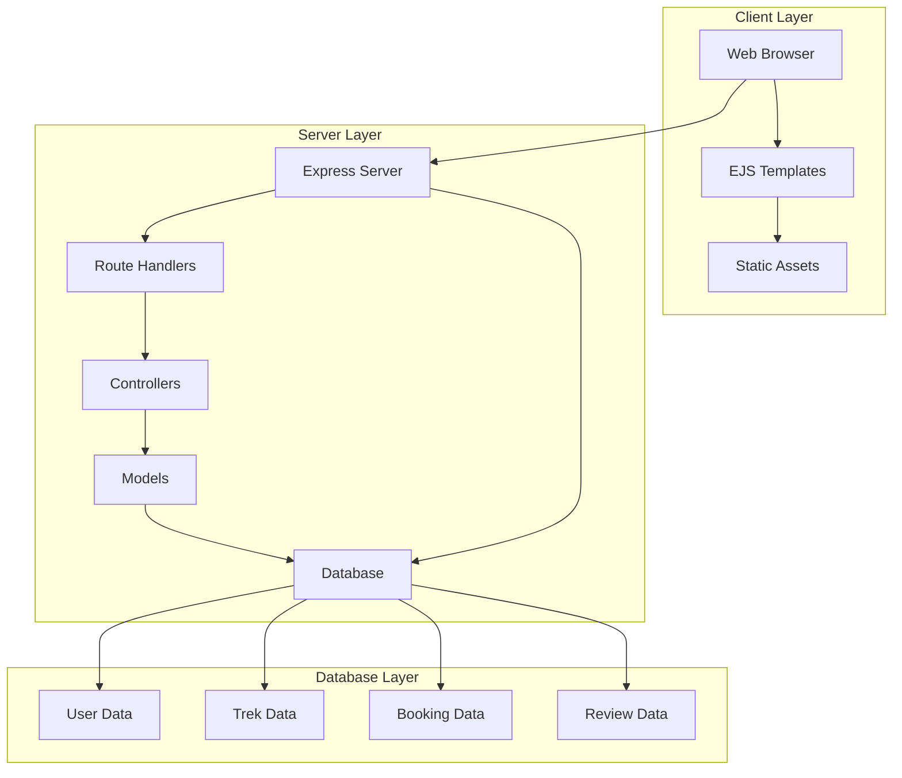
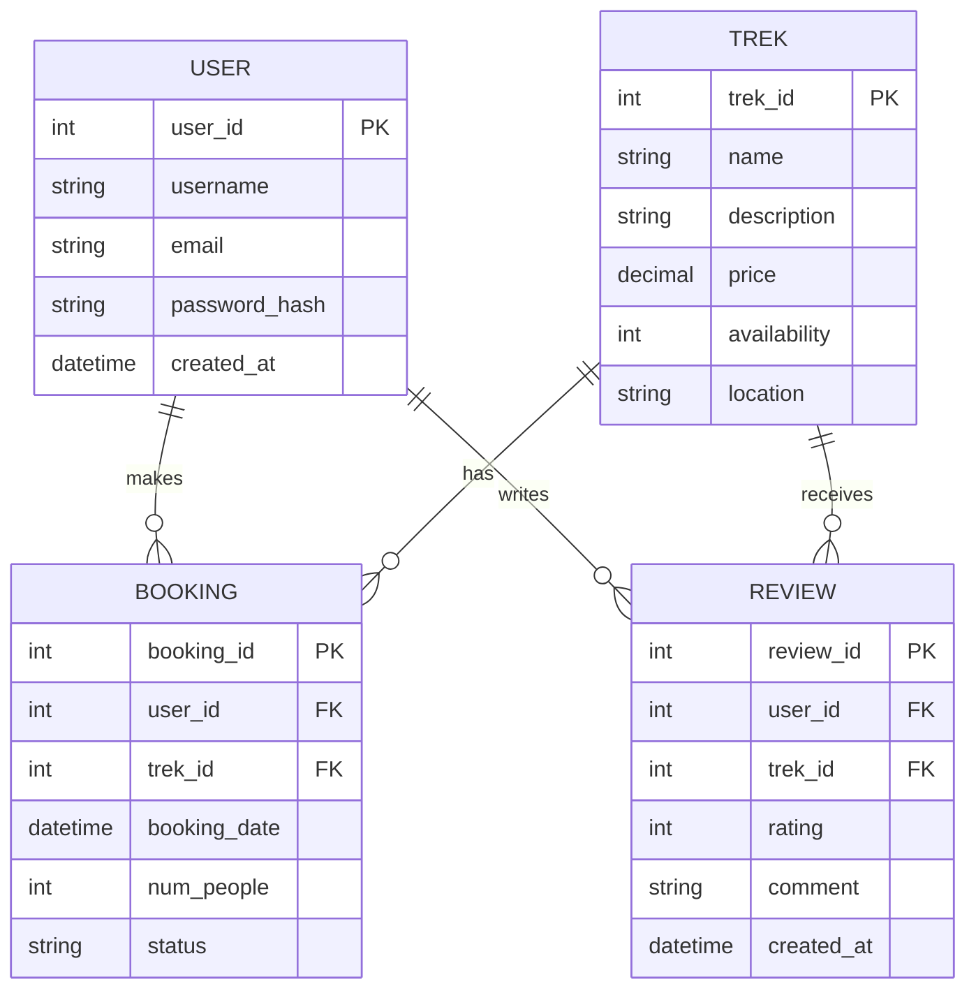

# Back-End High-Level Documentation

## Architecture Overview

### Type
BookYourTrek follows a monolithic architecture built with Node.js and Express.js. The application uses a traditional MVC (Model-View-Controller) pattern with server-side rendering.

### Tech Stack
- **Runtime Environment**: Node.js
- **Web Framework**: Express.js
- **Database**: MySQL
- **Template Engine**: EJS
- **Authentication**: Session-based
- **API Style**: RESTful

## System Architecture

## Key Services and Modules

### 1. Authentication Service
- User registration
- Login/logout management
- Session handling
- Password management

### 2. Trek Management Service
- Trek CRUD operations
- Availability checking
- Pricing management
- Image handling

### 3. Booking Service
- Booking creation
- Payment processing
- Availability updates
- Booking history

### 4. Review Service
- Review management
- Rating calculations
- User feedback
- Content moderation

## Database Structure

## API Flow

### 1. Request Flow
1. Client sends HTTP request
2. Express middleware processes request
3. Route handler identifies endpoint
4. Controller processes business logic
5. Model interacts with database
6. Response sent back to client

### 2. Authentication Flow
1. User submits credentials
2. Server validates input
3. Database checks credentials
4. Session created if valid
5. Response with session token

### 3. Booking Flow
1. User selects trek
2. System checks availability
3. User submits booking details
4. Payment processing
5. Booking confirmation
6. Database updates

## Security Architecture

### 1. Authentication
- Session-based authentication
- Password hashing
- JWT tokens (optional)
- Role-based access control

### 2. Data Protection
- Input validation
- SQL injection prevention
- XSS protection
- CSRF protection

### 3. API Security
- Rate limiting
- Request validation
- Error handling
- Logging

## Performance Considerations

### 1. Database Optimization
- Indexed queries
- Connection pooling
- Query caching
- Batch operations

### 2. Server Optimization
- Response compression
- Static file caching
- Load balancing
- Error handling

### 3. Application Optimization
- Code splitting
- Lazy loading
- Resource caching
- Memory management

## Deployment Architecture

### 1. Development Environment
- Local development setup
- Development database
- Testing environment
- Debug tools

### 2. Production Environment
- Production server
- Production database
- Monitoring tools
- Backup systems

### 3. Deployment Process
- Version control
- Build process
- Testing
- Deployment pipeline

## Monitoring and Maintenance

### 1. Logging
- Error logging
- Access logging
- Performance metrics
- Security events

### 2. Monitoring
- Server health
- Database performance
- API response times
- Error rates

### 3. Maintenance
- Regular updates
- Security patches
- Database maintenance
- Backup procedures

## Development Guidelines

### 1. Code Standards
- Consistent formatting
- Documentation requirements
- Testing requirements
- Review process

### 2. Version Control
- Branch strategy
- Commit conventions
- Release process
- Deployment tags

### 3. Testing Strategy
- Unit testing
- Integration testing
- Performance testing
- Security testing 