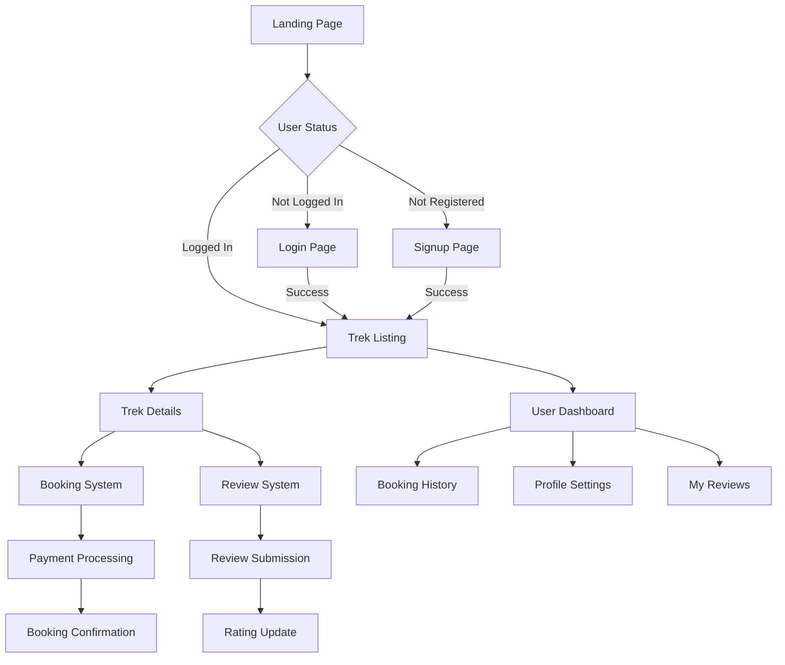

# Front-End High-Level Documentation

## Architecture Overview

### Type
BookYourTrek follows a traditional server-side rendered (SSR) architecture using EJS (Embedded JavaScript) templating engine. This approach provides:
- Faster initial page loads
- Better SEO capabilities
- Reduced client-side complexity
- Improved security

### Tech Stack
- **Frontend Framework**: EJS (Embedded JavaScript)
- **Server Framework**: Express.js
- **Styling**: CSS
- **Client-side JavaScript**: Vanilla JS
- **Template Engine**: EJS

## Folder Structure
```
BookYourTrek--Full-Stack-Website/
├── views/                    # EJS template files
│   ├── authentication/       # Login and signup pages
│   ├── treks/               # Trek detail pages
│   └── user/                # User management pages
├── public/                  # Static assets
│   ├── css/                # Stylesheets
│   ├── js/                 # Client-side scripts
│   └── images/             # Image assets
└── Documentation/          # Project documentation
```

## Major Components

### 1. Authentication System
- Login page
- Signup page
- Session management
- Password recovery

### 2. Trek Management
- Trek listing
- Trek details
- Booking system
- Review system

### 3. User Management
- Profile management
- Booking history
- Review management
- Settings

## Component Flow Diagram



## Communication Patterns

### 1. Server-Client Communication
- Form submissions
- AJAX requests
- Page navigation
- Data fetching

### 2. Data Flow
- Server-side rendering
- Database queries
- Session management
- State persistence

### 3. Component Interaction
- Page navigation
- Form submissions
- Dynamic content updates
- User feedback

## API Interaction

### 1. Authentication Endpoints
- Login
- Signup
- Logout
- Session management

### 2. Trek Endpoints
- List treks
- Get trek details
- Check availability
- Get reviews

### 3. Booking Endpoints
- Create booking
- Update booking
- Cancel booking
- View booking history

### 4. Review Endpoints
- Create review
- Update review
- Delete review
- Get trek reviews

## Key Features from Low-Level Documentation

### 1. Component Architecture
- Modular page structure
- Reusable components
- Consistent styling
- Responsive design

### 2. State Management
- Server-side sessions
- Form state handling
- User preferences
- Booking state

### 3. Security Features
- Input validation
- XSS prevention
- CSRF protection
- Secure authentication

### 4. Performance Optimizations
- Static asset caching
- Image optimization
- Lazy loading
- Code splitting

## User Experience Considerations

### 1. Navigation
- Intuitive menu structure
- Clear call-to-actions
- Breadcrumb navigation
- Search functionality

### 2. Forms
- Input validation
- Error handling
- Success feedback
- Auto-save functionality

### 3. Responsiveness
- Mobile-first design
- Adaptive layouts
- Touch-friendly interfaces
- Cross-browser compatibility

### 4. Accessibility
- Semantic HTML
- ARIA labels
- Keyboard navigation
- Screen reader support

## Development Guidelines

### 1. Code Organization
- Modular components
- Consistent naming
- Clear documentation
- Version control

### 2. Best Practices
- Clean code principles
- Performance optimization
- Security measures
- Testing procedures

### 3. Deployment
- Build process
- Environment configuration
- Error monitoring
- Performance tracking 