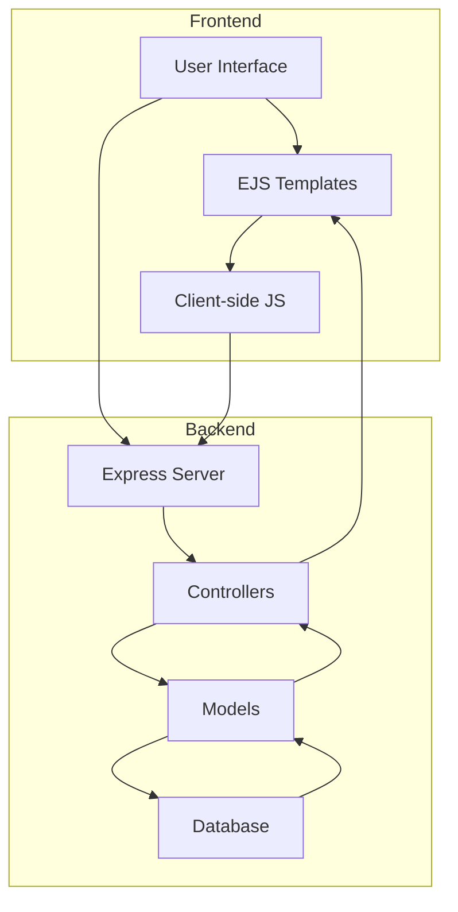

# BookYourTrek - Overall Documentation

## Project Overview

### Purpose
BookYourTrek is a full-stack web application designed to facilitate trek booking and management. The platform allows users to browse various trek locations, make bookings, and share their experiences through reviews.

### Key Features
- User authentication and authorization
- Trek browsing and searching
- Booking management
- Review system
- User profile management
- Admin dashboard

## Technical Architecture

### Frontend
- **Type**: Server-Side Rendered (SSR) application
- **Framework**: EJS (Embedded JavaScript)
- **Styling**: CSS
- **Client-side**: Vanilla JavaScript
- **Key Components**:
  - Authentication pages
  - Trek listing and details
  - Booking system
  - Review system
  - User dashboard

### Backend
- **Runtime**: Node.js
- **Framework**: Express.js
- **Database**: MySQL
- **Authentication**: Session-based
- **Key Services**:
  - User management
  - Trek management
  - Booking processing
  - Review handling

## System Flow

## Data Flow

### 1. User Journey
1. User visits website
2. Browses trek listings
3. Creates account/logs in
4. Makes booking
5. Adds reviews

### 2. System Processes
1. Request handling
2. Authentication
3. Data processing
4. Database operations
5. Response generation

## Security Implementation

### 1. Authentication
- Secure login system
- Password hashing
- Session management
- Role-based access

### 2. Data Protection
- Input validation
- SQL injection prevention
- XSS protection
- CSRF protection

### 3. API Security
- Rate limiting
- Request validation
- Error handling
- Secure endpoints

## Performance Optimization

### 1. Frontend
- Server-side rendering
- Static asset caching
- Image optimization
- Code splitting

### 2. Backend
- Database optimization
- Query caching
- Connection pooling
- Response compression

## Deployment

### 1. Requirements
- Node.js environment
- MySQL database
- Express.js server
- Static file hosting

### 2. Environment Setup
- Development environment
- Testing environment
- Production environment
- Monitoring tools

### 3. Deployment Process
- Version control
- Build process
- Testing
- Deployment pipeline

## Documentation Structure

### 1. Technical Documentation
- [Frontend Low-Level Documentation](front%20end%20low%20level.md)
- [Backend Low-Level Documentation](back%20end%20low%20level.md)
- [Frontend High-Level Documentation](front%20end%20high%20level.md)
- [Backend High-Level Documentation](back%20end%20high%20level.md)

### 2. Additional Resources
- API documentation
- Database schema
- Deployment guide
- Maintenance procedures

## Development Guidelines

### 1. Code Standards
- Consistent formatting
- Documentation requirements
- Testing requirements
- Review process

### 2. Version Control
- Branch strategy
- Commit conventions
- Release process
- Deployment tags

### 3. Testing Strategy
- Unit testing
- Integration testing
- Performance testing
- Security testing

## Maintenance and Support

### 1. Regular Maintenance
- Security updates
- Performance monitoring
- Database maintenance
- Backup procedures

### 2. Support Process
- Issue tracking
- Bug reporting
- Feature requests
- User support

### 3. Monitoring
- Server health
- Database performance
- API response times
- Error rates

## Future Enhancements

### 1. Planned Features
- Mobile application
- Payment gateway integration
- Advanced search filters
- Social sharing

### 2. Technical Improvements
- Microservices architecture
- Real-time updates
- Advanced caching
- Performance optimization

### 3. User Experience
- Enhanced UI/UX
- Mobile responsiveness
- Accessibility improvements
- User feedback system 