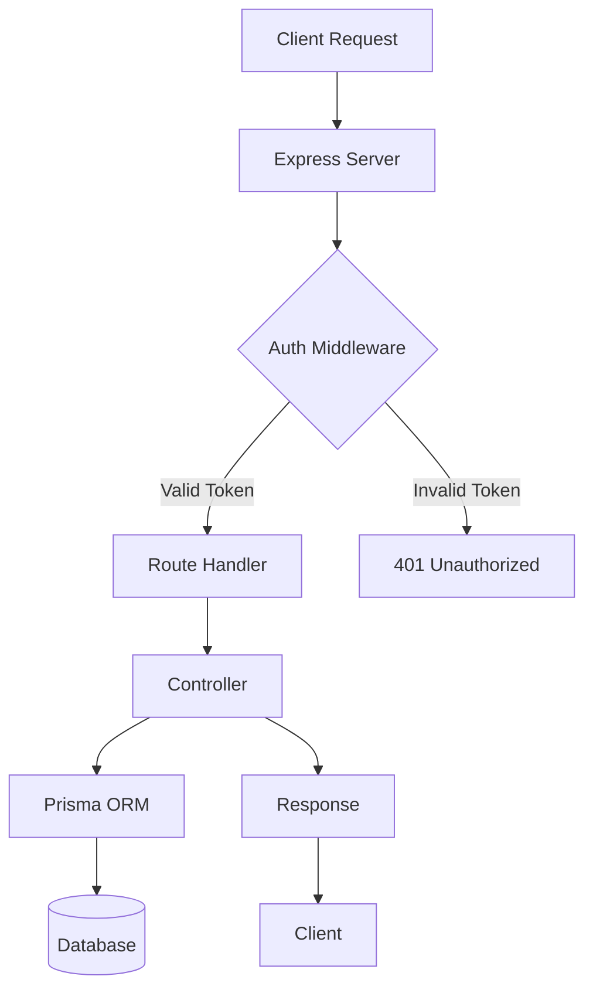
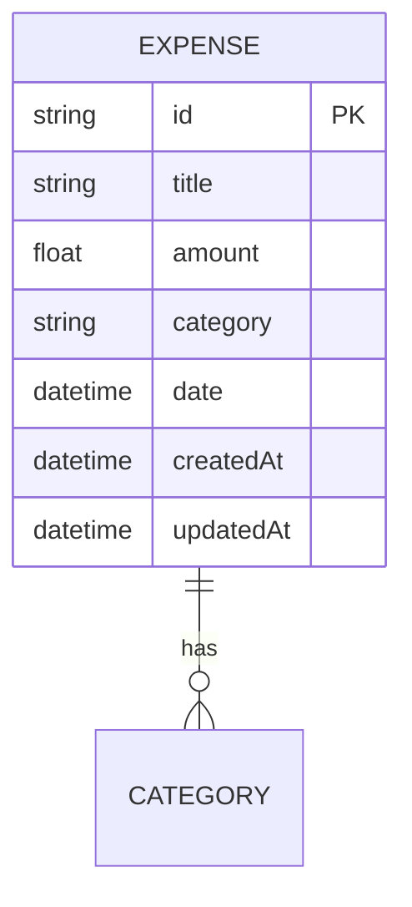

# Backend High-Level Documentation

## Architecture Overview

### Type
- RESTful API Server
- Monolithic Architecture
- Node.js/Express.js based

### Tech Stack
- **Runtime**: Node.js
- **Framework**: Express.js
- **Database**: SQL (via Prisma ORM)
- **Authentication**: JWT
- **API Documentation**: OpenAPI/Swagger

### Folder Structure
```
backend/
├── src/              # Source code
├── routes/           # API route definitions
├── controllers/      # Business logic
├── middleware/       # Custom middleware
├── prisma/          # Database schema and migrations
└── server.js        # Application entry point
```

### Key Services/Modules
1. **Authentication Service**
   - JWT token generation
   - User authentication
   - Token validation

2. **Expense Service**
   - CRUD operations
   - Data validation
   - Business logic

3. **Database Service**
   - Prisma ORM
   - Data models
   - Migrations

## Service Interaction Diagram



## API Flow and Endpoints

### Authentication Flow
1. Client sends credentials
2. Server validates and generates JWT
3. Token stored client-side
4. Token included in subsequent requests

### Expense Management Flow
1. **Create Expense**
   - Validate input
   - Create database record
   - Return created expense

2. **Read Expenses**
   - Fetch from database
   - Apply filters/sorting
   - Return expense list

3. **Update Expense**
   - Validate input
   - Update database record
   - Return updated expense

4. **Delete Expense**
   - Validate existence
   - Delete database record
   - Return success status

## Database Structure

### Entity Relationship Diagram


## Security Architecture

### Authentication
- JWT-based authentication
- Token expiration
- Refresh token mechanism
- Secure token storage

### Authorization
- Role-based access control
- Route protection
- Resource ownership

### Data Protection
- Input validation
- SQL injection prevention
- XSS protection
- CORS configuration

## Performance Considerations

### Caching Strategy
- Response caching
- Database query optimization
- Connection pooling

### Scalability
- Stateless design
- Horizontal scaling ready
- Load balancing support

### Monitoring
- Error logging
- Performance metrics
- Request tracking

## Deployment Considerations

### Environment Setup
- Development
- Staging
- Production

### Configuration Management
- Environment variables
- Secret management
- Database connections

### CI/CD Pipeline
- Automated testing
- Build process
- Deployment strategy 