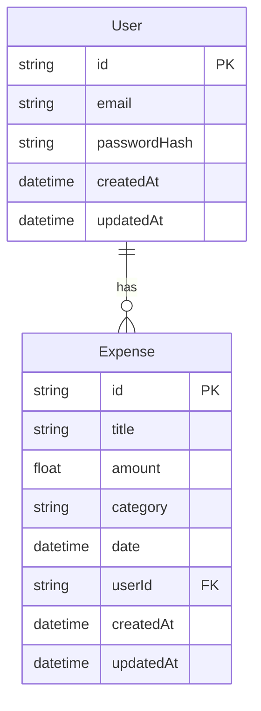
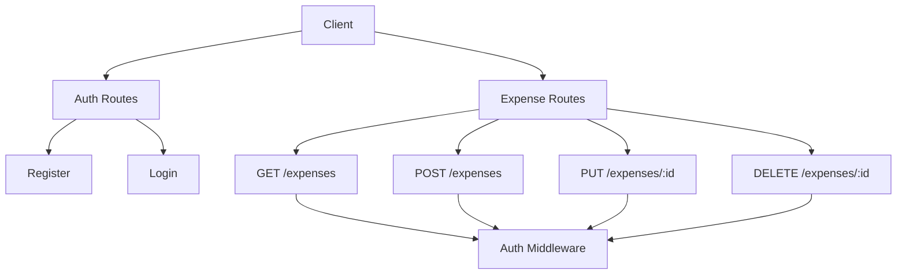
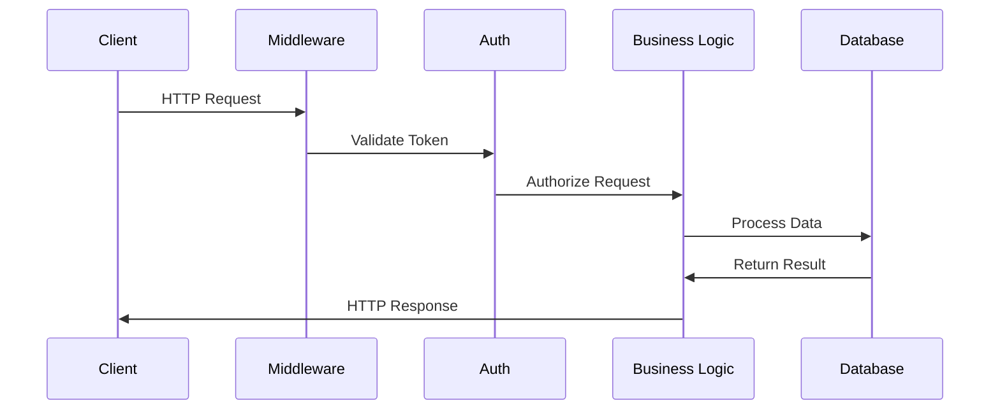

# Back-End High-Level Documentation

## Architecture Overview

### Application Type
- RESTful API Server
- Monolithic Architecture
- Node.js/Express.js based

### Tech Stack
- **Runtime**: Node.js
- **Framework**: Express.js
- **Database**: Prisma ORM
- **Authentication**: JWT
- **Validation**: Express-validator
- **Password Hashing**: bcrypt

### Folder Structure
```
backend/
├── src/              # Source code
├── routes/           # API route definitions
├── controllers/      # Business logic
├── middleware/       # Custom middleware
├── prisma/          # Database schema and migrations
└── server.js        # Application entry point
```

## Service Architecture

### Core Services
1. **Authentication Service**
   - User registration
   - Login management
   - JWT token generation
   - Password hashing

2. **Expense Service**
   - CRUD operations
   - Data validation
   - User-specific data access
   - Error handling

### Database Architecture



## API Architecture

### RESTful Endpoints


### Request/Response Flow
1. Client sends request
2. Request validated by middleware
3. Authentication checked
4. Business logic processed
5. Database operations performed
6. Response sent to client

## Security Architecture

### Authentication Flow
1. User registration/login
2. JWT token generation
3. Token validation middleware
4. Protected route access
5. Token expiration handling

### Authorization
- Role-based access control
- User-specific data isolation
- Resource ownership validation
- Secure password handling

## Data Flow

### Request Processing


### Error Handling
- Global error middleware
- Validation error handling
- Authentication error handling
- Database error handling

## Performance Considerations

### Database Optimization
- Efficient queries
- Proper indexing
- Connection pooling
- Query caching

### API Optimization
- Response compression
- Rate limiting
- Request validation
- Error handling

### Security Measures
- Input sanitization
- XSS protection
- CSRF protection
- Rate limiting

## Development Guidelines

### Code Organization
- Modular architecture
- Separation of concerns
- Clean code principles
- Consistent naming

### Best Practices
- Error handling
- Logging
- Documentation
- Testing

### Testing Strategy
- Unit tests
- Integration tests
- API tests
- Security tests

## Deployment Considerations

### Environment Configuration
- Environment variables
- Database configuration
- Security settings
- Logging setup

### Monitoring
- Error tracking
- Performance monitoring
- Database monitoring
- Security monitoring

### Scaling
- Horizontal scaling
- Load balancing
- Database scaling
- Caching strategies 