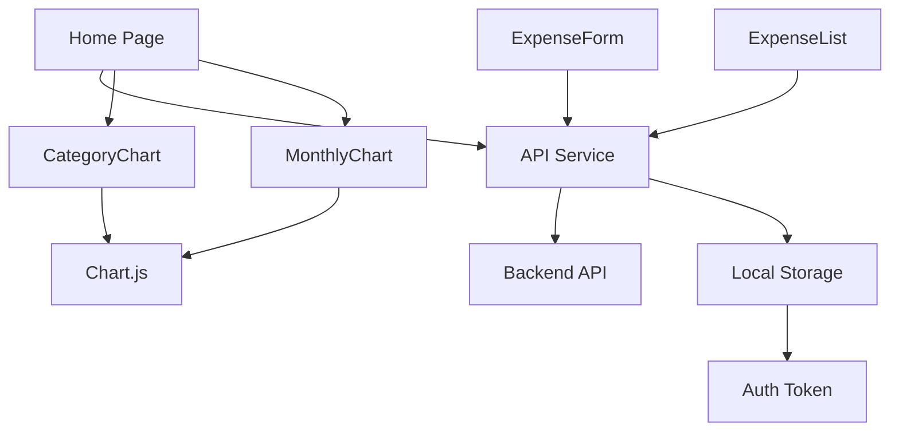

# Frontend High-Level Documentation

## Architecture Overview

### Type
- Single Page Application (SPA)
- Built with Next.js 13+ using App Router
- Client-side rendering for dynamic content

### Tech Stack
- **Framework**: Next.js
- **UI Library**: React
- **Styling**: Tailwind CSS
- **Data Visualization**: Chart.js
- **API Client**: Axios
- **TypeScript**: For type safety

### Folder Structure
```
frontend/
├── src/
│   ├── app/              # Next.js app router pages
│   ├── components/       # Reusable UI components
│   ├── services/         # API and external services
│   └── contexts/         # React context providers
├── public/              # Static assets
└── package.json         # Dependencies and scripts
```

### Major Components
1. **Pages**
   - Home/Dashboard
   - Expense Management
   - Analytics

2. **Components**
   - CategoryChart
   - MonthlyChart
   - ExpenseForm
   - ExpenseList

3. **Services**
   - API Service
   - Authentication Service

## Component Flow Diagram



## Communication Patterns

### State Management
- React's useState for local component state
- Context API for global state (if needed)
- No Redux/global state management required

### API Interaction
- Centralized API service
- Axios interceptors for auth
- RESTful endpoints
- TypeScript interfaces for type safety

### User Flow
1. User lands on dashboard
2. Views expense statistics
3. Can add/edit/delete expenses
4. Real-time updates to charts
5. Responsive design for all devices

## Key Technical Decisions

### 1. Next.js App Router
- Modern routing system
- Better performance
- Built-in API routes
- Server components support

### 2. TypeScript
- Type safety
- Better developer experience
- Improved maintainability
- Better IDE support

### 3. Tailwind CSS
- Utility-first approach
- Responsive design
- Custom theme support
- Reduced CSS bundle size

### 4. Chart.js
- Interactive charts
- Responsive design
- Customizable options
- Good performance

## Performance Optimizations
- Client-side caching
- Lazy loading of charts
- Optimized bundle size
- Responsive images
- Efficient state updates

## Security Considerations
- JWT token management
- Secure API communication
- Input validation
- XSS prevention
- CSRF protection 