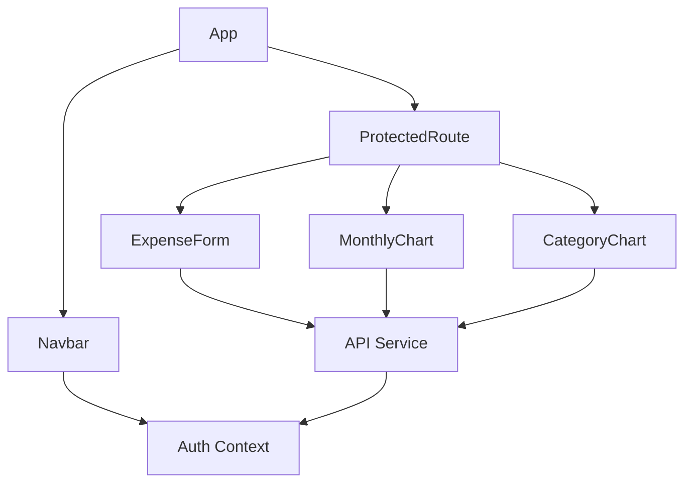

# Front-End High-Level Documentation

## Architecture Overview

### Application Type
- Single Page Application (SPA)
- Built with Next.js framework
- Client-side rendering for dynamic components

### Tech Stack
- **Framework**: Next.js
- **Language**: TypeScript
- **Styling**: Tailwind CSS
- **State Management**: React Context API
- **Data Visualization**: Recharts
- **HTTP Client**: Built-in fetch API

### Folder Structure
```
frontend/
├── src/
│   ├── app/              # Next.js app directory
│   ├── components/       # Reusable UI components
│   ├── services/        # API service layer
│   └── contexts/        # React context providers
├── public/              # Static assets
└── package.json         # Dependencies and scripts
```

## Component Architecture

### Core Components
1. **ExpenseForm**
   - Handles expense creation and editing
   - Form validation and data submission
   - User input management

2. **MonthlyChart**
   - Visualizes monthly expense trends
   - Interactive bar chart
   - Data aggregation and formatting

3. **CategoryChart**
   - Shows expense distribution by category
   - Interactive pie chart
   - Percentage calculations

4. **Navbar**
   - Navigation and authentication state
   - Responsive design
   - User session management

5. **ProtectedRoute**
   - Route protection wrapper
   - Authentication checks
   - Redirect handling

## Data Flow

### Component Communication


### State Management
- **Local State**: React useState for component-specific data
- **Global State**: Context API for authentication and user data
- **Form State**: Controlled components with local state

### API Integration
- Centralized API service layer
- RESTful endpoints for CRUD operations
- Authentication token management
- Error handling and loading states

## User Flow

### Authentication Flow
1. User visits application
2. Protected routes redirect to login
3. User authenticates
4. JWT token stored in localStorage
5. Protected routes accessible

### Expense Management Flow
1. User views dashboard
2. Can add new expenses
3. View expense charts
4. Edit/delete existing expenses
5. Real-time updates

## Performance Optimizations

### Client-Side
- Component lazy loading
- Efficient data processing
- Responsive design
- Optimized re-renders

### Data Management
- Efficient data structures
- Caching strategies
- Pagination support
- Optimistic updates

## Security Considerations

### Authentication
- JWT token management
- Secure storage
- Token expiration handling
- Protected route implementation

### Data Protection
- Input validation
- XSS prevention
- CSRF protection
- Secure API communication

## Development Guidelines

### Code Organization
- Component-based architecture
- Clear separation of concerns
- Reusable components
- Consistent file structure

### Best Practices
- TypeScript for type safety
- Component composition
- Props validation
- Error boundaries
- Loading states

### Testing Strategy
- Component unit tests
- Integration tests
- E2E testing
- Performance testing

## Deployment Considerations

### Build Process
- Next.js build optimization
- Asset optimization
- Environment configuration
- Production builds

### Monitoring
- Error tracking
- Performance monitoring
- User analytics
- Server health checks 