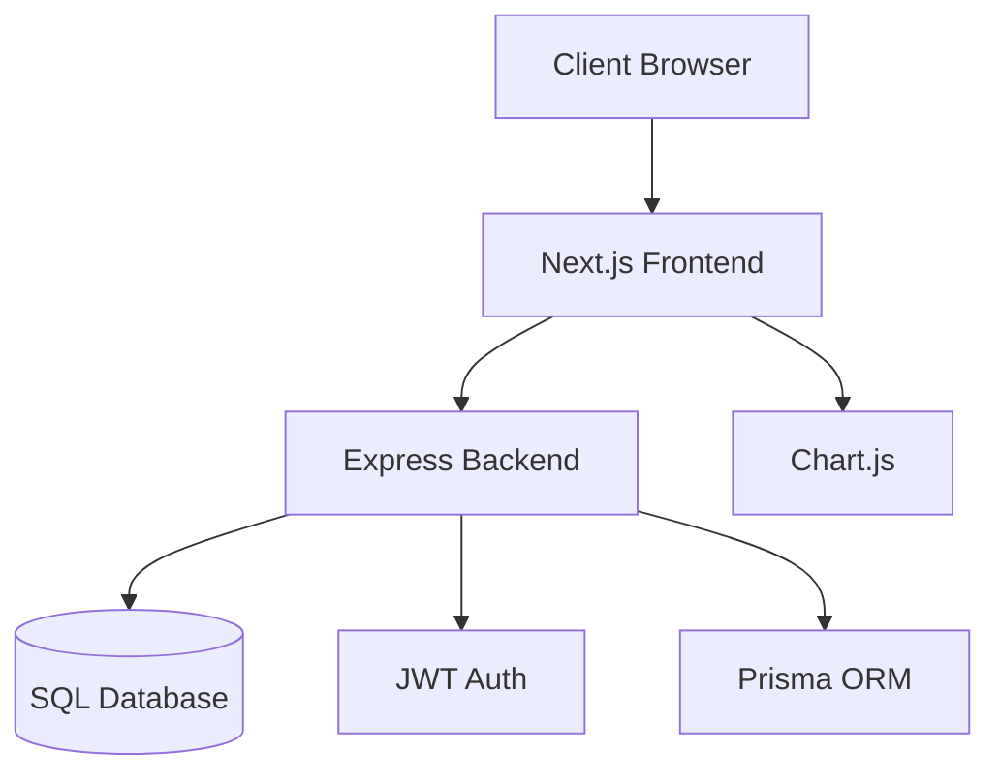

# Expense Tracker - Overall Documentation

## Project Overview

### Purpose
The Expense Tracker is a web application designed to help users manage and track their expenses. It provides features for adding, viewing, and analyzing expenses with visual representations through charts and graphs.

### Key Features
- Expense creation and management
- Category-based expense tracking
- Monthly expense visualization
- Interactive charts and graphs
- Secure user authentication
- Responsive design for all devices

## Technical Architecture

### Frontend
- Next.js 13+ with App Router
- React for UI components
- TypeScript for type safety
- Tailwind CSS for styling
- Chart.js for data visualization
- Axios for API communication

### Backend
- Node.js/Express.js server
- RESTful API architecture
- Prisma ORM for database operations
- JWT for authentication
- SQL database

## System Architecture



## Data Flow
1. User interacts with frontend interface
2. Frontend makes authenticated API calls
3. Backend validates requests and processes data
4. Database operations performed via Prisma
5. Results returned to frontend
6. UI updated with new data

## Security Implementation
- JWT-based authentication
- Secure API endpoints
- Input validation
- XSS protection
- CSRF protection
- Secure token storage

## Deployment Architecture
- Frontend: Vercel/Netlify
- Backend: Node.js hosting (e.g., Heroku, DigitalOcean)
- Database: Managed SQL service
- CI/CD pipeline for automated deployment

## Development Workflow
1. Local development setup
2. Feature development
3. Testing
4. Code review
5. Deployment to staging
6. Production deployment

## Documentation References

### Detailed Documentation
- [Frontend Low-Level Documentation](front%20end%20low%20level.md)
  - Component details
  - API integration
  - State management
  - Performance considerations

- [Backend Low-Level Documentation](back%20end%20low%20level.md)
  - API endpoints
  - Database models
  - Authentication
  - Error handling

- [Frontend High-Level Documentation](front%20end%20high%20level.md)
  - Architecture overview
  - Component flow
  - Technical decisions
  - Performance optimizations

- [Backend High-Level Documentation](back%20end%20high%20level.md)
  - Service architecture
  - API flows
  - Security architecture
  - Deployment considerations

## Getting Started

### Prerequisites
- Node.js 16+
- npm or yarn
- SQL database
- Git

### Installation
1. Clone the repository
2. Install frontend dependencies:
   ```bash
   cd frontend
   npm install
   ```
3. Install backend dependencies:
   ```bash
   cd backend
   npm install
   ```
4. Set up environment variables
5. Run database migrations
6. Start development servers

### Development
- Frontend: `npm run dev`
- Backend: `npm run dev`
- Database: Configure connection string

### Testing
- Frontend: `npm run test`
- Backend: `npm run test`
- E2E: `npm run test:e2e`

## Maintenance and Support

### Monitoring
- Application metrics
- Error tracking
- Performance monitoring
- User analytics

### Backup and Recovery
- Database backups
- Configuration backups
- Disaster recovery plan

### Updates and Maintenance
- Regular dependency updates
- Security patches
- Feature updates
- Bug fixes

## Future Enhancements
- Mobile application
- Advanced analytics
- Budget planning
- Export functionality
- Multi-currency support
- Receipt scanning 