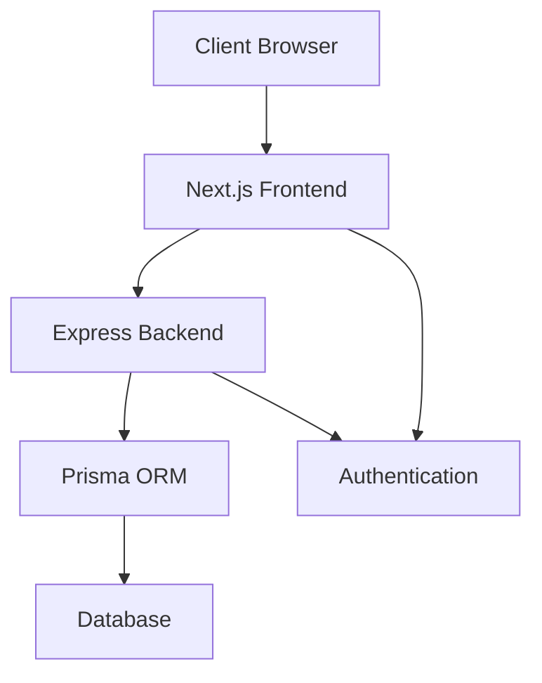

# Expense Tracker - Overall Documentation

## Project Overview

### Purpose
The Expense Tracker is a web application designed to help users manage and track their personal expenses. It provides features for expense recording, categorization, and visualization through interactive charts.

### Key Features
- User authentication and authorization
- Expense creation, editing, and deletion
- Expense categorization
- Monthly expense tracking
- Category-based expense analysis
- Interactive data visualization
- Responsive design

## Technical Overview

### Front-End
- **Framework**: Next.js with TypeScript
- **UI Components**: Custom components with Tailwind CSS
- **State Management**: React Context API
- **Data Visualization**: Recharts
- **Authentication**: JWT-based authentication

### Back-End
- **Runtime**: Node.js
- **Framework**: Express.js
- **Database**: Prisma ORM
- **Authentication**: JWT with bcrypt
- **API**: RESTful architecture

## System Architecture

### High-Level Architecture

### Data Flow
1. User interacts with frontend
2. Frontend makes authenticated API calls
3. Backend validates requests
4. Database operations performed
5. Results returned to frontend
6. UI updated with new data

## Security Overview

### Authentication
- JWT-based authentication
- Secure password hashing
- Protected routes
- Token expiration

### Data Protection
- Input validation
- XSS prevention
- CSRF protection
- Secure API communication

## Performance Considerations

### Frontend
- Component lazy loading
- Efficient data processing
- Responsive design
- Optimized re-renders

### Backend
- Database optimization
- API response caching
- Rate limiting
- Error handling

## Development Guidelines

### Code Standards
- TypeScript for type safety
- Component-based architecture
- Clean code principles
- Comprehensive documentation

### Testing
- Unit testing
- Integration testing
- E2E testing
- Performance testing

## Deployment

### Requirements
- Node.js environment
- Database server
- Environment variables
- SSL certificates

### Process
1. Frontend build
2. Backend deployment
3. Database setup
4. Environment configuration
5. Monitoring setup

## Documentation References

### Detailed Documentation
1. [Front-End Low-Level Documentation](front%20end%20low%20level.md)
   - Component details
   - Props and state management
   - API integration
   - Performance considerations

2. [Back-End Low-Level Documentation](back%20end%20low%20level.md)
   - API endpoints
   - Controllers
   - Database models
   - Authentication

3. [Front-End High-Level Documentation](front%20end%20high%20level.md)
   - Architecture overview
   - Component flow
   - State management
   - User flow

4. [Back-End High-Level Documentation](back%20end%20high%20level.md)
   - Service architecture
   - API architecture
   - Security architecture
   - Data flow

## Maintenance and Support

### Monitoring
- Error tracking
- Performance monitoring
- User analytics
- Server health checks

### Updates
- Regular dependency updates
- Security patches
- Feature additions
- Bug fixes

### Support
- Issue tracking
- User feedback
- Documentation updates
- Performance optimization 