# Back-End High-Level Documentation

## Architecture Overview

### System Type
- **Type**: Monolithic with Microservices Architecture
- **Core Framework**: Node.js with Express.js
- **Language**: JavaScript/TypeScript
- **Database**: Multiple database support
- **Real-time**: WebSocket integration

### Tech Stack
- **Runtime**: Node.js
- **Web Framework**: Express.js
- **Real-time**: Socket.io
- **Authentication**: JWT
- **File Processing**: Custom file handlers
- **Logging**: Custom logger
- **Backup**: Custom backup system
- **PHP Integration**: PHP-FPM

## System Architecture

### Core Components
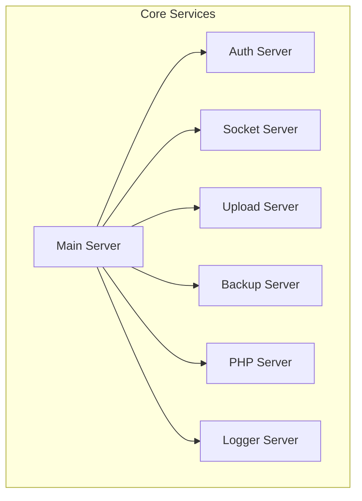

### Service Interactions
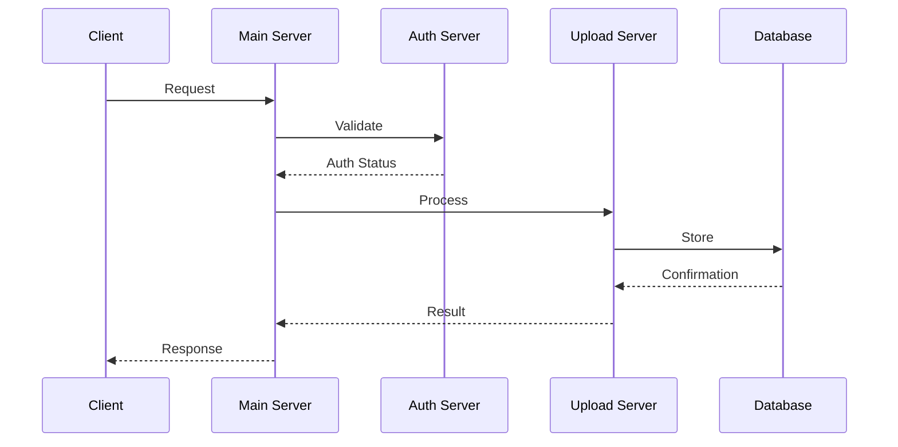

## Directory Structure

```
backend/
├── core/           # Core system functionality
├── routes/         # API route handlers
├── utils/          # Utility functions
├── plugins/        # Plugin system
├── call/           # API call handlers
├── server-*.js     # Server components
└── Dockerfile      # Container configuration
```

## API Architecture

### Route Structure
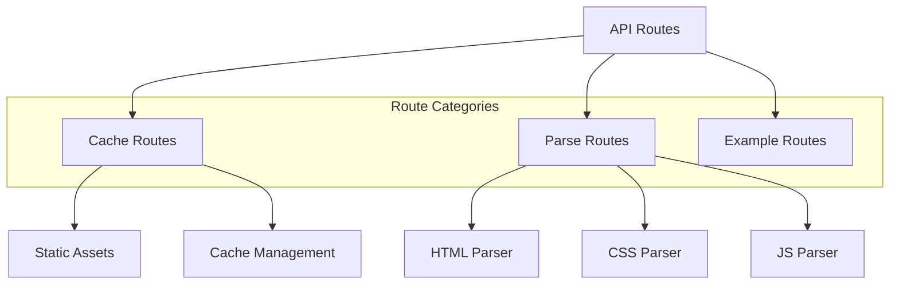

### API Flow
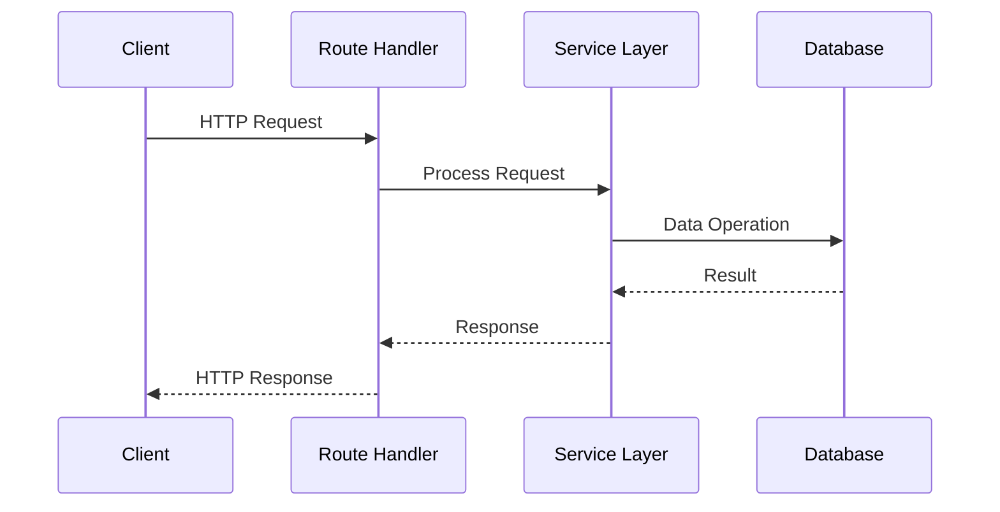

## Security Architecture

### Authentication Flow
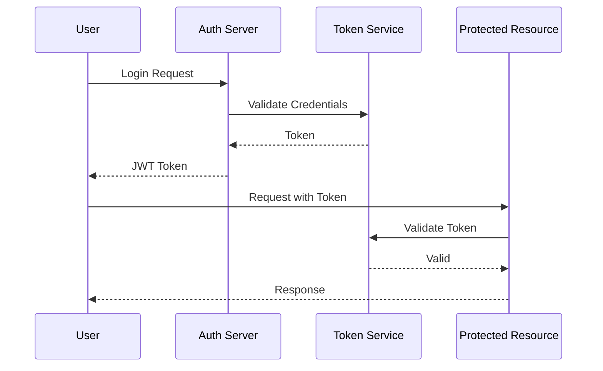

### Security Layers
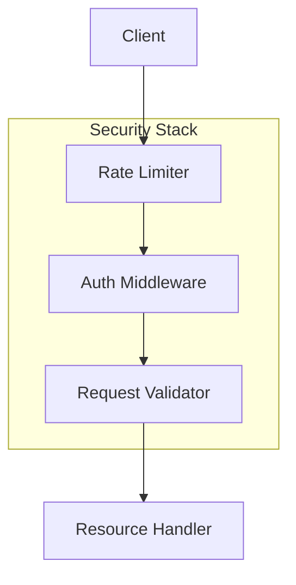

## Data Management

### Database Structure
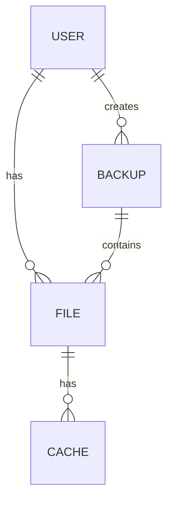

### Caching Strategy
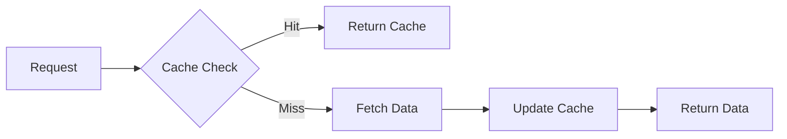

## Performance Architecture

### Load Balancing
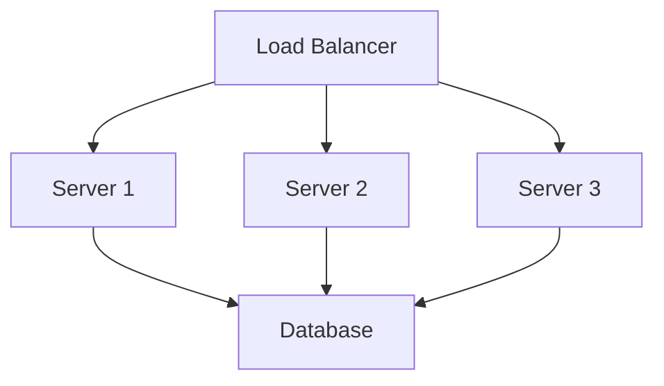

### Resource Management
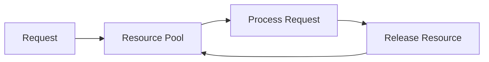

## Monitoring and Logging

### Logging Architecture
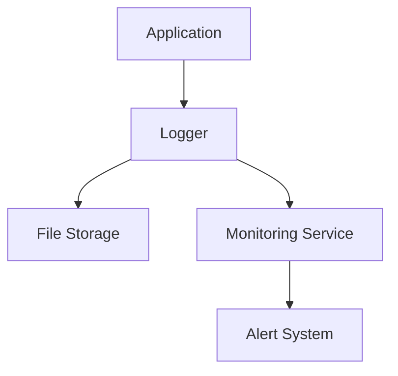

### Health Checks
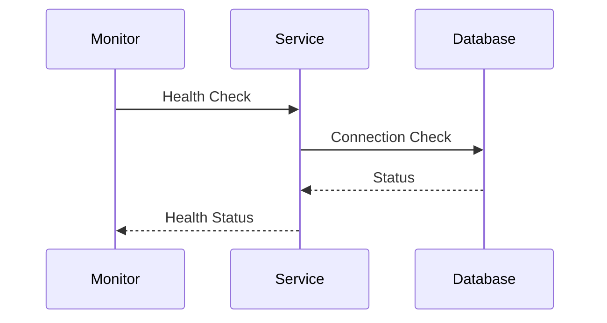

## Deployment Architecture

### Container Structure
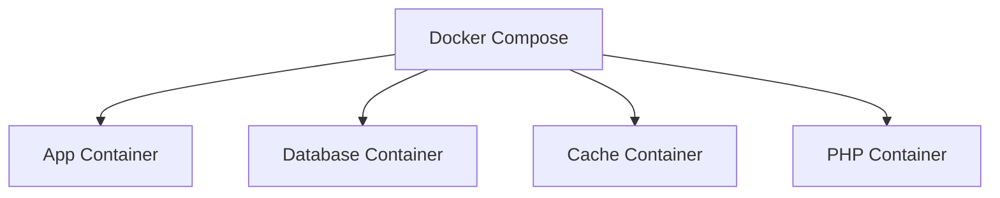

### Scaling Strategy
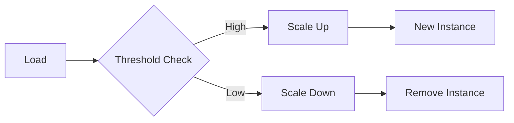

## Development Guidelines

### Code Organization
- Modular architecture
- Service-based design
- Plugin system
- Utility functions

### Best Practices
- Error handling
- Logging standards
- Security protocols
- Performance optimization

## Deployment Considerations

### Environment Setup
- Development
- Staging
- Production
- Testing

### Monitoring
- Performance metrics
- Error tracking
- Resource usage
- Health monitoring 