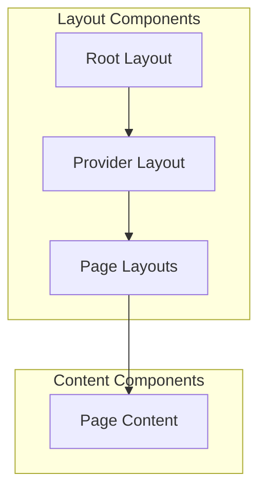
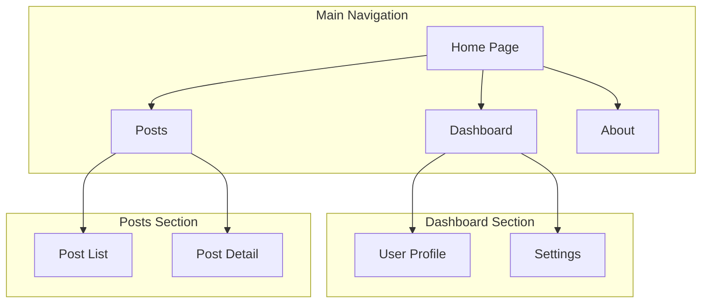
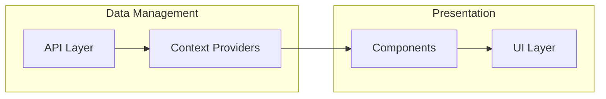
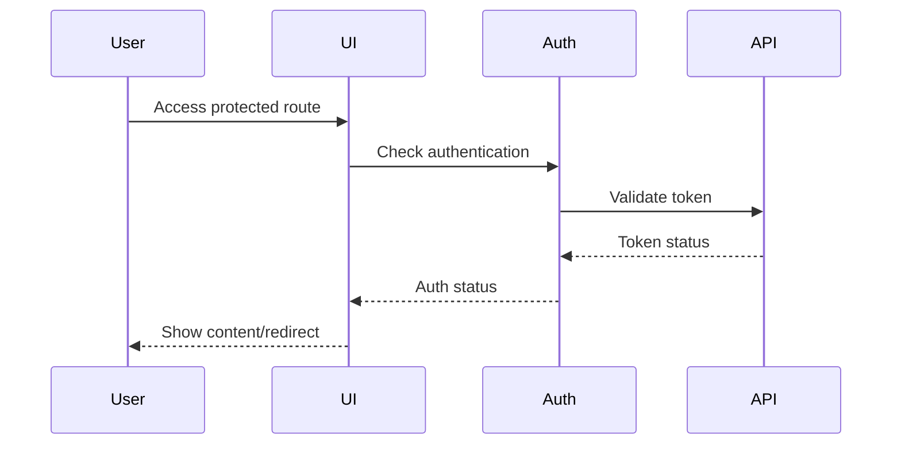
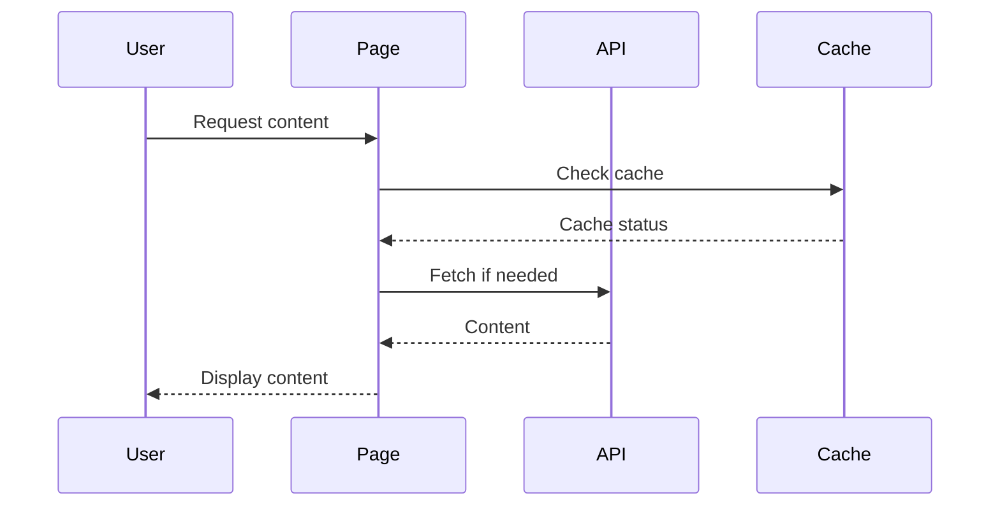

# Front-End High-Level Documentation

## Architecture Overview

### Application Type
- **Type**: Single Page Application (SPA) with Server-Side Rendering (SSR)
- **Framework**: Next.js 13+ with App Router
- **Language**: TypeScript
- **State Management**: React Context API

### Tech Stack
- **Core Framework**: Next.js
- **UI Library**: React
- **Styling**: CSS Modules
- **Type System**: TypeScript
- **Routing**: Next.js App Router
- **State Management**: React Context
- **API Integration**: REST APIs

## Folder Structure

```
app/
├── api/                 # API routes
├── components/          # Shared components
├── dashboard/          # Dashboard pages
├── posts/             # Blog posts section
├── pagination/        # Pagination components
├── md-render.html/    # Markdown rendering
├── nested-routes/     # Nested routing examples
├── sign-in.html/      # Authentication
├── layout.tsx         # Root layout
├── page.tsx           # Home page
└── not-found.tsx      # 404 page
```

## Component Architecture

### Layout System


### Page Flow


## Communication Patterns

### State Management
- **Context API**: Used for global state management
- **Local State**: React useState for component-level state
- **Server State**: Next.js data fetching methods

### Data Flow


## API Integration

### API Structure
- RESTful endpoints
- Server-side API routes
- Client-side data fetching

### Data Fetching Patterns
- Server-side rendering (SSR)
- Static site generation (SSG)
- Client-side data fetching
- Incremental static regeneration (ISR)

## User Flow

### Authentication Flow


### Content Loading Flow


## Performance Optimizations

### Loading Strategies
- Lazy loading of components
- Image optimization
- Code splitting
- Route prefetching

### Caching Strategy
- Static page caching
- API response caching
- Asset caching
- Client-side caching

## Security Considerations

### Front-end Security
- XSS prevention
- CSRF protection
- Input validation
- Secure data transmission

### Authentication
- JWT token management
- Session handling
- Protected routes
- Secure storage

## Development Guidelines

### Code Organization
- Feature-based structure
- Shared components
- Utility functions
- Type definitions

### Best Practices
- TypeScript usage
- Component composition
- Error boundaries
- Performance monitoring

## Deployment Considerations

### Build Process
- Environment configuration
- Asset optimization
- Bundle analysis
- Build verification

### Monitoring
- Error tracking
- Performance monitoring
- User analytics
- Health checks 