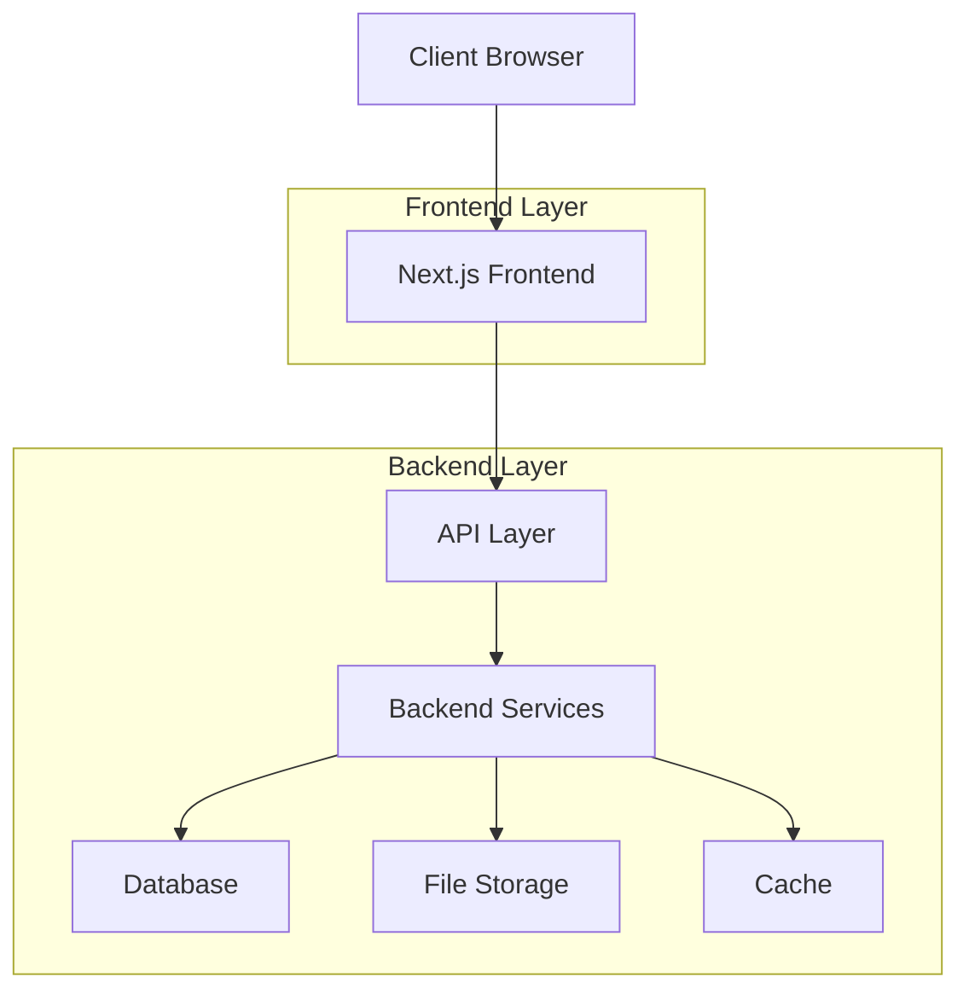
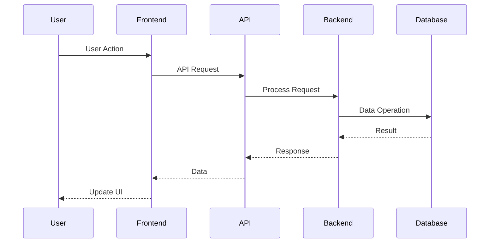
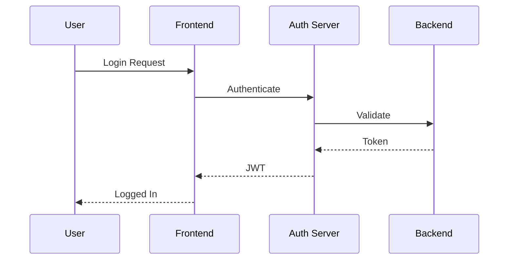
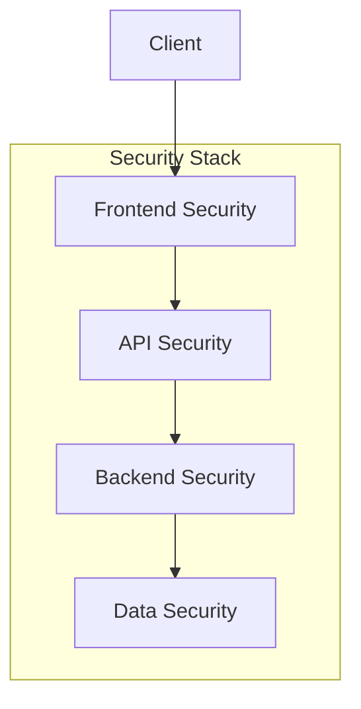

# Fullstack Next.js Application Template - Overall Documentation

## Project Overview

### Purpose
This is a comprehensive full-stack application template built with Next.js, providing a robust foundation for building modern web applications. The template includes both front-end and back-end components, with a focus on scalability, security, and developer experience.

### Key Features
- Modern Next.js 13+ with App Router
- TypeScript support
- Full-stack architecture
- Real-time capabilities
- Authentication system
- File handling
- Caching system
- Backup functionality
- PHP integration
- Comprehensive logging

## System Architecture

### High-Level Overview


### Technology Stack

#### Frontend
- **Framework**: Next.js 13+
- **Language**: TypeScript
- **UI Library**: React
- **State Management**: React Context
- **Styling**: CSS Modules
- **Routing**: Next.js App Router

#### Backend
- **Runtime**: Node.js
- **Framework**: Express.js
- **Real-time**: Socket.io
- **Authentication**: JWT
- **File Processing**: Custom handlers
- **Logging**: Custom logger
- **Backup**: Custom system
- **PHP Integration**: PHP-FPM

## System Components

### Frontend Components
- Layout system
- Page components
- Shared components
- API integration
- State management
- Routing system

### Backend Services
- Authentication server
- Socket server
- Upload server
- Backup server
- PHP server
- Logger server

## Data Flow

### Application Flow


### Authentication Flow


## Security Architecture

### Security Layers


### Security Features
- JWT authentication
- XSS protection
- CSRF protection
- Rate limiting
- Input validation
- Secure file handling
- Data encryption

## Performance Optimization

### Frontend Optimization
- Code splitting
- Lazy loading
- Image optimization
- Static generation
- Incremental static regeneration

### Backend Optimization
- Caching system
- Load balancing
- Resource pooling
- Database optimization
- File system caching

## Development Workflow

### Local Development
1. Clone repository
2. Install dependencies
3. Set up environment variables
4. Start development servers
5. Access application

### Deployment Process
1. Build application
2. Run tests
3. Deploy to staging
4. Verify functionality
5. Deploy to production

## Monitoring and Maintenance

### Monitoring
- Error tracking
- Performance monitoring
- Resource usage
- Health checks
- User analytics

### Maintenance
- Regular backups
- Log rotation
- Cache cleanup
- Security updates
- Dependency updates

## Documentation Structure

### Available Documentation
1. [Frontend Low-Level Documentation](front%20end%20low%20level.md)
   - Detailed component documentation
   - Function specifications
   - State management details

2. [Backend Low-Level Documentation](back%20end%20low%20level.md)
   - Service specifications
   - API documentation
   - Database models

3. [Frontend High-Level Documentation](front%20end%20high%20level.md)
   - Architecture overview
   - Component relationships
   - Data flow patterns

4. [Backend High-Level Documentation](back%20end%20high%20level.md)
   - System architecture
   - Service interactions
   - Security patterns

## Getting Started

### Prerequisites
- Node.js 16+
- npm or yarn
- Git
- Docker (optional)

### Installation
```bash
# Clone repository
git clone [repository-url]

# Install dependencies
npm install

# Set up environment variables
cp .env.example .env

# Start development servers
npm run dev
```

### Configuration
- Environment variables
- Database settings
- API endpoints
- Security settings

## Contributing

### Development Guidelines
- Code style
- Testing requirements
- Documentation standards
- Pull request process

### Best Practices
- TypeScript usage
- Component composition
- Error handling
- Performance optimization

## License
[License Information]

## Support
[Support Information] 